# 👋 Hi, I'm Shivi Srivastava

### AI/ML Student • Computer Vision • Hyperspectral Imaging • Space & Defence Technology

---

<h2 align="center">💫 About Me</h2>

I'm a B.Tech AI/ML student who enjoys turning ideas into practical, meaningful technology.
 
My interests lie at the intersection of <b>Artificial Intelligence, Computer Vision, Geospatial Science and Space Technology</b>.

Currently, I'm exploring <b>AI/ML, Hyperspectral Imaging and Computer Vision</b> through hands-on projects,
while continuously strengthening my foundations in <b>Machine Learning, Deep Learning and Data Structures</b>.

I enjoy working on problems where technology can make something <b>faster, smarter or simply possible</b>.
I'm especially interested in applications of AI in <b>space, remote sensing and defence technology</b>.

🚀 Building • 🧠 Learning • 🔬 Exploring • 🛰️ Dreaming beyond Earth

<h2 align="center">🌐 Connect With Me</h2>

<h2 align="center">💻 Tech Stack</h2>

<h2 align="center">📊 GitHub Stats</h2>

<h2 align="center">🏆 GitHub Trophies</h2>

<h2 align="center">🚀 Contribution Graph</h2>

<picture>
  <source media="(prefers-color-scheme: dark)" srcset="https://raw.githubusercontent.com/Shivi-Srivastava-4444/Shivi-Srivastava-4444/output/galaga-contribution-graph-dark.svg">
  <source media="(prefers-color-scheme: light)" srcset="https://raw.githubusercontent.com/Shivi-Srivastava-4444/Shivi-Srivastava-4444/output/galaga-contribution-graph.svg">
  
</picture>

---

<i>“Building technology for problems worth solving.”</i>

⭐ Thanks for visiting my profile!

